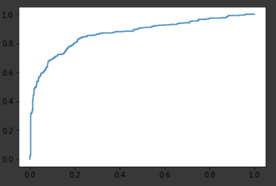
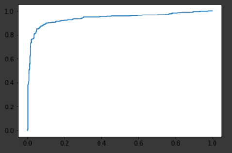
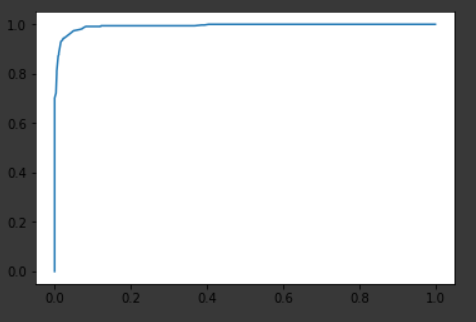

# Activity 2
CoE202(A) / 20190146 Kim Yohan

## Before improvement
----
### Problem 1.
**Compare the prediction accuracies of the 3 models.**

* Logistic Regression
```py
classifier = LogisticRegression()
```
* SVM Classifier
```py
classifier = SVC(probability=True) # has rbf kernel
```
* Random Forest Classifier
```py
classifier = RandomForestClassifier()
```

And accuracies are taken like this:
```py
accuracy = classifier.score(X_train, Y_train) * 100
```
$$accuracy(y, \hat{y}) = \frac{1}{n_{samples}} \sum^{n_{samples} - 1}_{i = 0} 1 (\hat{y_i} = y_i)$$

<center>

| Logistic Regression | SVM Classifier  | Random Forest Classifier |
|:-------------------:|:---------------:|:------------------------:|
|       0.8036        |      0.9102     |          0.9697          |

</center>

----
### Problem 2.
**Draw the ROCs of the 3 models.**
```py
FPR, TPR, thresholds = roc_curve(Y_train, Y_train_pred)

plt.plot(FPR, TPR)
```

<center>

| Logistic Regression | SVM Classifier  | Random Forest Classifier |
|:-------------------:|:---------------:|:------------------------:|
||||

</center>

----

### Problem 3
**Obtain the AUCs(Areas Under Curves). which model performs the best?**
```py
AUC = roc_auc_score(Y_train, Y_train_pred)
```

<center>

| Logistic Regression | SVM Classifier  | Random Forest Classifier |
|:-------------------:|:---------------:|:------------------------:|
|         0.87        |       0.94      |            0.99          |

</center>

----

## Improvements
### Modifying preprocessing
The comparison accuracy have been taken from 8-chunked cross validation.
So the "Before" accuracy is lower than the value of problem 1.

Used classifier is SVM Classifier: `SVC(probability=True, gamma='auto')`

#### #1 Reviving FamilySize
Although there is some differences between family of four and family of ten but they're considered same as it is binary.
So I have revived family size and applied normalization to FamilySize.

##### Comparison
|        |      Accuracy     |
|--------|-------------------|
| Before | 0.7285 (± 0.0706) |
| After  | 0.7274 (± 0.0686) |

As the mean accuracy have been decreased, it won't be used.

#### #2 Embarked to one-hot
Originally embarked was a numeric value: 0, 1, 2  
But I have mapped this into one-hot vector: [1, 0, 0], [0, 1, 0], [0, 0, 1]  
as numerical relation doesn't hold between Q, C, S.

($2C \neq S$)

##### Comparison
|        |      Accuracy     |
|--------|-------------------|
| Before | 0.7285 (± 0.0706) |
| After  | 0.7353 (± 0.0778) |

#### #3 Parsing Cabin
Although many cabin are empty, as cabin means position in ship, it might worth reviving.

First, we split cabins by whitespace.
There are A-G cabins except the one `T` cabin.  
So, we'll remove the `T` cabin.

Second, we'll make it to vector with length 7(A~G). If a customer has some cabins in a deck, it will be 1. Otherwise it will be 0.

##### Comparison
|        |      Accuracy     |
|--------|:-----------------:|
| Before | 0.7285 (± 0.0706) |
| After  | 0.7421 (± 0.0858) |

#### #4 Title to one-hot
Originally title was a numeric value: 0, 1, ..., 5  
But I have mapped this into one-hot vector as numerical relation doesn't hold between titles.

##### Comparison
|        |      Accuracy     |
|--------|:-----------------:|
| Before | 0.7285 (± 0.0706) |
| After  | 0.7297 (± 0.0854) |

#### #5: Normalize Age, Fare, Pclass
As Age, Fare and Pclass values are not in $[0, 1]$ and relatively larger than other values, we normalize it to $[0, 1]$

##### Comparison
|        |      Accuracy     |
|--------|:-----------------:|
| Before | 0.7285 (± 0.0706) |
| After  | 0.8160 (± 0.0446) |

<!--
#### #6: Reviving tickets
This regexp can match tickets except `LINE`: `([A-Z0-9.\/ ]+? )?\d+`.  
For `LINE`, we drop the ticket info.  

Then this can be splitted into two parts: prefix and number

As prefix represents `Embarked`, we drop it. (STON/O2 ->S, A/5. -> S, PC -> C and more...)  

The number can be used to fill cabin. There are some people with same ticket number.
They're a group so if one of them have a cabin number, we can assume others also have same cabin number.  

* Although there are some exception (`PC 17485` have `E36` and `A20`)
but most of them have same cabin number or same deck.

##### Comparison
-->

### Modifying classifier
The comparison accuracy have been taken from 8-chunked cross validation.

#### SVC
##### Kernels
|          |        rbf        |   poly(degree=2)  |  poly(degree=3)   |  poly(degree=4)   |      sigmoid      |
|--------  |:-----------------:|:-----------------:|:-----------------:|:-----------------:|:-----------------:|
| Accuracy | 0.8182 (± 0.0484) | 0.8047 (± 0.0317) | 0.6162 (± 0.0032) | 0.6162 (± 0.0032) | 0.7911 (± 0.0472) |

##### C value
|          | 0.1               | 0.5               | 1.0               | 2.0               | 5.0               |
|----------|-------------------|-------------------|-------------------|-------------------|-------------------|
| Accuracy | 0.7867 (± 0.0432) | 0.7934 (± 0.0509) | 0.8182 (± 0.0484) | 0.8194 (± 0.0454) | 0.8171 (± 0.0499) |

##### Gamma
|          | 0.025             | 0.05              | 0.1               | 0.2               |
|----------|-------------------|-------------------|-------------------|-------------------|
| Accuracy | 0.8182 (± 0.0484) | 0.8194 (± 0.0454) | 0.8171 (± 0.0499) | 0.8171 (± 0.0714) |

#### RandomForest
##### N_estimators
|          | 16                | 32                | 64                | 128               |
|----------|-------------------|-------------------|-------------------|-------------------|
| Accuracy | 0.8070 (± 0.0487) | 0.8003 (± 0.0506) | 0.8070 (± 0.0393) | 0.7980 (± 0.0496) |

But it can be changed easily because of random. I used 64 as it shows genenerally good score when every time I run.

##### max_depth
|          | 2                 | 4                 | 8                 | 16                |
|----------|-------------------|-------------------|-------------------|-------------------|
| Accuracy | 0.7889 (± 0.0434) | 0.8149 (± 0.0500) | 0.8317 (± 0.0747) | 0.8149 (± 0.0511) |

##### min_samples_split
|          | Default           | 0.01              | 0.05              | 0.1               | 0.5               |
|----------|-------------------|-------------------|-------------------|-------------------|-------------------|
| Accuracy | 0.8261 (± 0.0630) | 0.8328 (± 0.0695) | 0.8260 (± 0.0793) | 0.8170 (± 0.0408) | 0.7889 (± 0.0512) |
