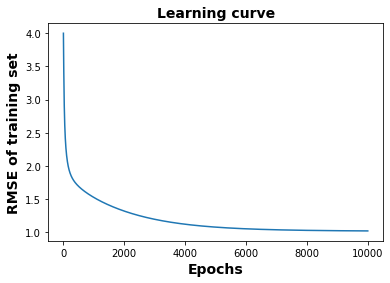
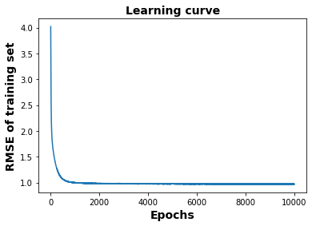
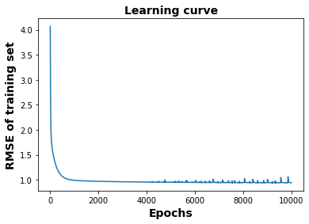

# Activity 3
CoE202(A) / 20190146 Kim Yohan

## Part 1. Momentum Optimizer
> Use the "MomentumOptimizer()" instead of the GradientDescentOptimizer and
> compare the RMSE learning curves of the two optimizers. When you use MomentumOptimizer,
> set the momentum at 0.9 and adjust the learning rate.

* Creating MomentumOptimizer
```py
momentum_optimizer = tf.train.MomentumOptimizer(lr, 0.9)
    .minimize(cost, global_step=global_step)
```

* Training
```py
for epoch in  range(n_epochs + 1):
    feed = {X: (ratingTrain[:, 0:2], ratingTrain[:, 2], [d1, d2])}
    _, avg_cost = sess.run((momentum_optimizer, cost), feed_dict = feed)
    losses.append(np.sqrt(avg_cost))
```

|     | GradientDescentOptimizer | MomentumOptimizer (momentum=0.9) |
|:---:|:------------------------:|:--------------------------------:|
| Learning Curve |  |  |
| RMSE Test | 0.86527 | 0.85554 |
| RMSE Train | 0.83430 | 0.81943 |

RMSE of both train and test have been decreased and using the learning curve, we can know
RMSE have been decreased more quickly. Using MomentumOptimizer, it have converged faster as it has "momentum".

## Part 2. Batch normalization
> Apply "batch normalization" to the 1st and 2nd hidden layers of the autoencoder in Part 1,
> and compare the resulting RMSE learning curves with those obtained above.

* Use `is_train`
  * When training, use  
  `feed = {X: ..., is_train: True}`
  
  * When testing, use  
  `feed = {X: ..., is_train: False}`

  * Add `is_train` as parameter
  ```py
  def autoencoder(_X, _is_train, _units, _l2_lambda, _n_ratings):
  ```

* In hidden layer 1:
```py
h1 = tf.sparse_tensor_dense_matmul(_X, w1) + b1
h1 = tf.layers.batch_normalization(h1, training=_is_train)
h1 = tf.nn.relu(h1)
```

* In hidden layer 2:
```py
h2 = tf.matmul(h1, w2) + b2
h2 = tf.layers.batch_normalization(h2, training=_is_train)
h2 = tf.nn.sigmoid(h2)
```

* In creating optimizing function:
```py
update_ops = tf.get_collection(tf.GraphKeys.UPDATE_OPS)
with tf.control_dependencies(update_ops):
    momentum_optimizer = tf.train.MomentumOptimizer(lr, 0.9)
        .minimize(cost, global_step=global_step)
```

|     | batch_normalization |
|:---:|:------------------------:|
| Learning Curve |  |
| RMSE Test | 1.0626 |
| RMSE Train | 0.75401 |

The train RMSE have been decreased but the test RMSE have been increased.
And it seems that overfitting have been occurred.

## Part 3. Dropout
> Apply "Dropout" to the 1st and 2nd hidden layers of the autoencoder in Part 2,
> and compare the resulting RMSE learning curves with those obtained above.

* Set dropout probability  
If it is train, keep with 0.8. If it is in test, don't dropout.
```py
drop_prob = tf.cond(_is_train, lambda: 0.2, lambda: 0.0)
```

* Apply dropout
```py
h1 = tf.nn.relu(h1)
h1 = tf.nn.dropout(h1, rate=drop_prob)
```

```py
h2 = tf.nn.sigmoid(h2)
h2 = tf.nn.dropout(h2, rate=drop_prob)
```

|      | Dropout |
|:----:|:-------:|
| Learning Curve |  |
| RMSE Test | 0.94926 |
| RMSE Train | 0.72960 |

Both train and test RMSE have been decreased.

## Part 2.1, 3.1
I have tried with `tf.layer.BatchNormalization` and as it seems that it works better than
`tf.layers.batch_normalization`, I also append this.

```py
h1 = tf.sparse_tensor_dense_matmul(_X, w1) + b1
h1 = tf.layers.BatchNormalization()(h1)
h1 = tf.nn.relu(h1)
```

```py
h2 = tf.matmul(h1, w2) + b2
h2 = tf.layers.BatchNormalization()(h2)
h2 = tf.nn.sigmoid(h2)
```

|      | BatchNormalization | BatchNormalization + Dropout |
|:----:|:------------------:|:----------------------------:|
| Learning Curve |  |  |
| RMSE Test | 0.87648 | 0.86951 |
| RMSE Train | 0.74504 |  0.78780 |

When I used BatchNormalization, the RMSE train have been decreased but RMSE test have been increased also.
After Dropout, the RMSE train have been increased but RMSE test have been decreased.
