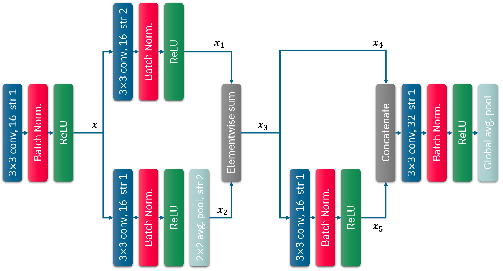
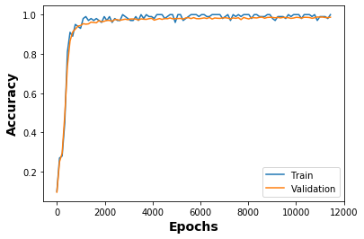

# Activity 4
CoE202(A) / 20190146 Kim Yohan

> Design the following CNN and apply the CNN to the MNIST dataset.



## 1. Implementation
```py
# (Conv > BN > ReLU) 1
# 3x3 filter, # of filters: 16, stride: 1
# output: (None, 28, 28, 16)
x = conv_bn_relu(images, filters=16, kernel_size=3, strides=[1,1])

# (Conv > BN > ReLU) 2
# 3x3 filter, # of filters: 16, stride: 2
# input: x (None, 28, 28, 16) / output: (None, 14, 14, 16)
x1 = conv_bn_relu(x, filters=16, kernel_size=3, strides=[2, 2])

# (Conv > BN > ReLU) 3 > Pool
# Conv: 3x3 filter, # of filters: 16, stride: 1
# Pool: 2x2 pool, stride: 2
# input: x (None, 28, 28, 16) / output: (None, 14, 14, 16)
x2 = conv_bn_relu(x, filters=16, kernel_size=3, strides=[1, 1])
x2 = tf.layers.average_pooling2d(x2, pool_size=[2, 2], strides=[2, 2])

# Element-wise Sum (x1 + x2)
# input: (None, 14, 14, 16) / output: (None, 14, 14, 16)
x3 = tf.add(x1, x2)

# (Conv > BN > ReLU) 4
# 3x3 filter, # of filters: 16, stride: 1
# input: (None, 14, 14, 16) / output: (None, 14, 14, 16)
x5 = conv_bn_relu(x3, filters=16, kernel_size=3, strides=[1, 1])

# Concatenate (x3, x5)
# Axis: 3
# input: (None, 14, 14, 16) * 2 / output: (None, 14, 14, 32)
output = tf.concat((x3, x5), axis=3)

# (Conv > BN > ReLU) 5
# 3x3 filter, # of filters: 32, stride: 1
# input: (None, 14, 14, 32) / output: (None, 14, 14, 32)
output = conv_bn_relu(output, filters=32, kernel_size=3, strides=[1, 1])

# Global Average Pool
# Axis: 1, 2
# input: (None, 14, 14, 32) / output: (None, 32)
output = tf.reduce_mean(output, axis = [1, 2])
```

As this changes output from `(None, 64)` to `(None, 32)`, I have removed the `Reshape Layer`.
```py
## Reshape
# feats = tf.reshape(feats, [batch_size, 32])
```

Also, I have modified some code in training to plot accuracies.

## 2. Result
Logs during the train:
```
[*] TRAINING Iteration 0, Loss: 0.4653, Acc: 0.8100, Val Acc: 0.7378 (Took 10.197s)
[*] TRAINING Iteration 1, Loss: 0.2434, Acc: 0.9300, Val Acc: 0.9444 (Took 7.892s)
[*] TRAINING Iteration 2, Loss: 0.1185, Acc: 0.9700, Val Acc: 0.9600 (Took 7.852s)
[*] TRAINING Iteration 3, Loss: 0.0477, Acc: 0.9700, Val Acc: 0.9708 (Took 7.895s)
[*] TRAINING Iteration 4, Loss: 0.0657, Acc: 0.9700, Val Acc: 0.9712 (Took 7.864s)
[*] TRAINING Iteration 5, Loss: 0.0478, Acc: 0.9700, Val Acc: 0.9778 (Took 7.853s)
[*] TRAINING Iteration 6, Loss: 0.1469, Acc: 1.0000, Val Acc: 0.9758 (Took 7.869s)
[*] TRAINING Iteration 7, Loss: 0.0287, Acc: 1.0000, Val Acc: 0.9798 (Took 7.865s)
[*] TRAINING Iteration 8, Loss: 0.0899, Acc: 1.0000, Val Acc: 0.9786 (Took 7.878s)
[*] TRAINING Iteration 9, Loss: 0.0688, Acc: 0.9800, Val Acc: 0.9830 (Took 7.870s)
[*] TRAINING Iteration 10, Loss: 0.1168, Acc: 0.9900, Val Acc: 0.9790 (Took 7.838s)
[*] TRAINING Iteration 11, Loss: 0.0569, Acc: 1.0000, Val Acc: 0.9774 (Took 7.835s)
[*] TRAINING Iteration 12, Loss: 0.0370, Acc: 0.9900, Val Acc: 0.9840 (Took 7.899s)
[*] TRAINING Iteration 13, Loss: 0.0488, Acc: 1.0000, Val Acc: 0.9842 (Took 7.847s)
[*] TRAINING Iteration 14, Loss: 0.0179, Acc: 0.9800, Val Acc: 0.9854 (Took 7.922s)
[*] TRAINING Iteration 15, Loss: 0.0554, Acc: 0.9900, Val Acc: 0.9814 (Took 7.865s)
[*] TRAINING Iteration 16, Loss: 0.0146, Acc: 0.9900, Val Acc: 0.9858 (Took 7.843s)
[*] TRAINING Iteration 17, Loss: 0.0549, Acc: 0.9900, Val Acc: 0.9808 (Took 7.878s)
[*] TRAINING Iteration 18, Loss: 0.0632, Acc: 1.0000, Val Acc: 0.9864 (Took 7.835s)
[*] TRAINING Iteration 19, Loss: 0.0340, Acc: 0.9700, Val Acc: 0.9878 (Took 7.874s)
[*] TRAINING Iteration 20, Loss: 0.0380, Acc: 1.0000, Val Acc: 0.9866 (Took 7.833s)
Optimization done.
```

The learning curve is shown as:  


And final accuracy is shown as:
|          |  Train  | Validation |  Test  |
|:--------:|:-------:|:----------:|:------:|
| Accuracy | 1.0000  |   0.9866   | 0.9852 |

## 3. Comparison
It seems no apparent difference in performance when the error range is considered
as the modified vggnet, which was trained in the in-class activity, has test accuracy `0.990`.

But, we have used some sample of whole dataset in this activity 
and the results may vary if the whole dataset is used.
